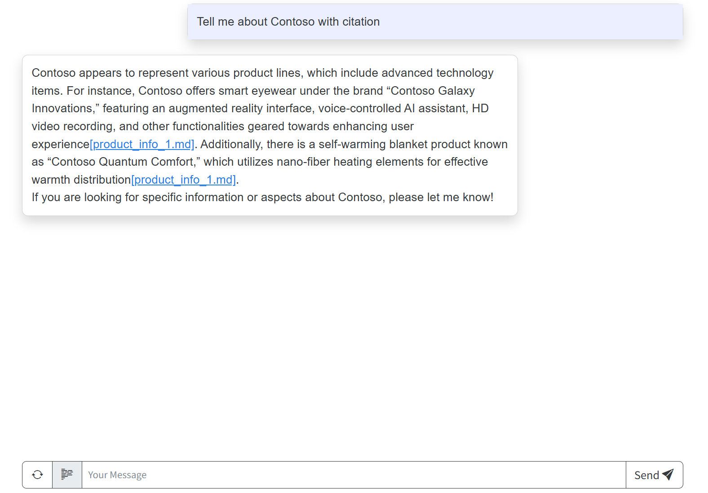

# Getting Started with Agents Using Azure AI Foundry

The agent leverages the Azure AI Agent service and utilizes file search for knowledge retrieval from uploaded files, enabling it to generate responses with citations. The solution also includes built-in monitoring capabilities with tracing to ensure easier troubleshooting and optimized performance.

<div style="text-align:center;">

[**SOLUTION OVERVIEW**](#solution-overview) \| [**GETTING STARTED**](#getting-started) \| [**CONFIGURE YOUR ENVIRONMENT**](#configure-your-environment)  \| [**DEPLOYMENT**](#deployment) \| [**GUIDANCE**](#guidance) \| [**RESOURCE CLEAN-UP**](#resource-clean-up) \| [**TRACING AND MONITORING**](#tracing-and-monitoring) \| [**AGENT EVALUATION**](#agent-evaluation) \|  [**AI RED TEAMING AGENT**](#ai-red-teaming-agent) \| [**TROUBLESHOOTING**](#troubleshooting)

</div>

## Solution Overview

This solution deploys a web-based chat application with an AI agent running in Azure Container App.

The agent leverages the Azure AI Agent service and utilizes Azure AI Search for knowledge retrieval from uploaded files, enabling it to generate responses with citations. The solution also includes built-in monitoring capabilities with tracing to ensure easier troubleshooting and optimized performance.

This solution creates an Azure AI Foundry project and Azure AI services. More details about the resources can be found in the [resources](#resources) documentation. There are options to enable logging, tracing, and monitoring.

Instructions are provided for deployment through GitHub Codespaces, VS Code Dev Containers, and your local development environment.

### Solution Architecture


The app code runs in Azure Container App to process the user input and generate a response to the user. It leverages Azure AI projects and Azure AI services, including the model and agent.

### Key Features

- **Knowledge Retrieval**<br/>
The AI agent uses file search to retrieve knowledge from uploaded files.

- **Customizable AI Model Deployment**<br/>
The solution allows users to configure and deploy AI models, such as gpt-4o-mini, with options to adjust model capacity, and knowledge retrieval methods.

- **Built-in Monitoring and Tracing**<br/>
Integrated monitoring capabilities, including Azure Monitor and Application Insights, enable tracing and logging for easier troubleshooting and performance optimization.

- **Flexible Deployment Options**<br/>
The solution supports deployment through GitHub Codespaces, VS Code Dev Containers, or local environments, providing flexibility for different development workflows.

- **Agent Evaluation**<br/>
This solution demonstrates how you can evaluate your agent's performance and quality during local development and incorporate it into monitoring and CI/CD workflow.

- **AI Red Teaming Agent**<br/>
Facilitates the creation of an AI Red Teaming Agent that can run batch automated scans for safety and security scans on your Agent solution to check your risk posture before deploying it into production.

<br/>

Here is a screenshot showing the chatting web application with requests and responses between the system and the user:



## Getting Started

### Quick Deploy

| [](https://codespaces.new/Azure-Samples/get-started-with-ai-agents) | [](https://vscode.dev/redirect?url=vscode://ms-vscode-remote.remote-containers/cloneInVolume?url=https://github.com/Azure-Samples/get-started-with-ai-agents) |
|---|---|

Github Codespaces and Dev Containers both allow you to download and deploy the code for development. You can also continue with local development. Once you have selected your environment, follow the instructions below to customize and deploy your solution.

### Prerequisites

#### Azure Account

If you do not have an Azure Subscription, you can sign up for a [free Azure account](https://azure.microsoft.com/free/) and create an Azure Subscription.

To deploy this Azure environment successfully, your Azure account (the account you authenticate with) must have the following permissions and prerequisites on the targeted Azure Subscription:

- **Microsoft.Authorization/roleAssignments/write** permissions at the subscription scope.  
  _(typically included if you have [Role Based Access Control Administrator](https://learn.microsoft.com/azure/role-based-access-control/built-in-roles#role-based-access-control-administrator-preview), [User Access Administrator](https://learn.microsoft.com/azure/role-based-access-control/built-in-roles#user-access-administrator), or [Owner](https://learn.microsoft.com/azure/role-based-access-control/built-in-roles#owner) role)_
- **Microsoft.Resources/deployments/write** permissions at the subscription scope.

You can view the permissions for your account and subscription by going to Azure portal, clicking 'Subscriptions' under 'Navigation' and then choosing your subscription from the list. If you try to search for your subscription and it does not come up, make sure no filters are selected. After selecting your subscription, select 'Access control (IAM)' and you can see the roles that are assigned to your account for this subscription. If you want to see more information about the roles, you can go to the 'Role assignments' tab and search by your account name and then click the role you want to view more information about.

#### Required tools

Make sure the following tools are installed:

1. [Azure Developer CLI (azd)](https://aka.ms/install-azd) Install or update to the latest version. Instructions can be found on the linked page.
2. [Python 3.9+](https://www.python.org/downloads/)
3. [Git](https://git-scm.com/downloads)
4. \[Windows Only\] [PowerShell](https://learn.microsoft.com/powershell/scripting/install/installing-powershell-on-windows) of the latest version, needed only for local application development on Windows operation system. Please make sure that power shell executable `pwsh.exe` is added to the `PATH` variable.

## Configure your Environment

This section details the customizable options for this solution, including agent model, knowledge retrieval, logging, tracing, and quota recommendations. If you want to proceed with the default settings, continue to the [deployment section](#deployment).

#### Code

If you are using one of the [Quick Deploy options](#quick-deploy), open the codespace now.

If you are not using any of the Quick Deploy options, download the project code:

```shell
git clone https://github.com/Azure-Samples/get-started-with-ai-agents.git
```

At this point you could make changes to the code if required. However, no changes are needed to deploy and test the app as shown in the next step.

#### Configurable Deployment Settings

When you start a deployment, most parameters will have default values. You can change the following default settings:

| **Setting** | **Description** |  **Default value** |
|------------|----------------|  ------------|
| **Existing Project Resource ID** | Specify an existing project resource ID to be used instead of provisioning new Azure AI Foundry project and Azure AI services. |   |
| **Azure Region** | Select a region with quota which supports your selected model. |   |
| **Model** | Choose from the [list of models supported by Azure AI Agent Service](https://learn.microsoft.com/azure/ai-services/agents/concepts/model-region-support) for your selected region. | gpt-4o-mini |  
| **Model Format** | Choose from OpenAI or Microsoft, depending on your model. | OpenAI |  
| **Model Deployment Capacity** | Configure capacity for your model. | 80k |
| **Embedding Model** | Choose from text-embedding-3-large, text-embedding-3-small, and text-embedding-ada-002. This may only be deployed if Azure AI Search is enabled. |  text-embedding-3-small |
| **Embedding Model Capacity** | Configure capacity for your embedding model. |  50k |
| **Knowledge Retrieval** | Choose from OpenAI's file search or including Azure AI Search Index. |  OpenAI's file search |

For a detailed description of customizable fields and instructions, view the [deployment customization guide](docs/deploy_customization.md).

#### How to configure Agent knowledge retrieval
By default, the template deploys OpenAI's [file search](https://learn.microsoft.com/azure/ai-services/agents/how-to/tools/file-search?tabs=python&pivots=overview) for agent's knowledge retrieval. An agent also can perform search using the search index, deployed in Azure AI Search resource. The semantic index search represents so-called hybrid search i.e. it uses LLM to search for the relevant context in the provided index as well as embedding similarity search. This index is built from the `embeddings.csv` file, containing the embeddings vectors, followed by the contexts.
To use index search, please set the local environment variable `USE_AZURE_AI_SEARCH_SERVICE` to `true` during the `azd up` command. In this case the Azure AI Search resource will be deployed and used. For more information on Azure AI serach, please see the [Azure AI Search Setup Guide](docs/ai_search.md)

To specify the model (e.g. gpt-4o-mini, gpt-4o) that is deployed for the agent when `azd up` is called, set the following environment variables:

```shell
azd env set AZURE_AI_AGENT_MODEL_NAME <MODEL_NAME>
azd env set AZURE_AI_AGENT_MODEL_VERSION <MODEL_VERSION>
```

#### How to configure tracing and azure monitor

To enable tracing for AI Agent to Azure Monitor, set the following environment variable:

```shell
azd env set ENABLE_AZURE_MONITOR_TRACING true
```

To enable message contents to be included in the traces, set the following environment variable. Note that the messages may contain personally identifiable information.

```shell
azd env set AZURE_TRACING_GEN_AI_CONTENT_RECORDING_ENABLED true
```

You can view the App Insights tracing in Azure AI Foundry. Select your project on the Azure AI Foundry page and then click 'Tracing'.

#### Quota Recommendations

The default for the model capacity in deployment is 30k tokens. For optimal performance, it is recommended to increase to 100k tokens. You can change the capacity by following the steps in [setting capacity and deployment SKU](docs/deploy_customization.md#customizing-model-deployments).

- Navigate to the home screen of the [Azure AI Foundry Portal](https://ai.azure.com/)
- Select Quota Management buttom at the bottom of the home screen
* In the Quota tab, click the GlobalStandard dropdown and select the model and region you are using for this accelerator to see your available quota. Please note gpt-4o-mini and text-embedding-3-small are used as default.
- Request more quota or delete any unused model deployments as needed.

## Deployment

### Deployment Options

Pick from the options below to see step-by-step instructions for: GitHub Codespaces, VS Code Dev Containers, and Local Environments. If you encounter an issue with any of the following options, try a different one.

<details>
  <summary><b>GitHub Codespaces</b></summary>

#### GitHub Codespaces

You can run this template virtually by using GitHub Codespaces. The button will open a web-based VS Code instance in your browser:

1. Open the template (this may take several minutes):

    [](https://codespaces.new/Azure-Samples/get-started-with-ai-agents)

2. Open a terminal window
3. Continue with the [deploying steps](#deploying-steps)

</details>

<details>
  <summary><b>VS Code Dev Containers</b></summary>

#### VS Code Dev Containers

A related option is VS Code Dev Containers, which will open the project in your local VS Code using the [Dev Containers extension](https://marketplace.visualstudio.com/items?itemName=ms-vscode-remote.remote-containers):

1. Start Docker Desktop (install it if not already installed [Docker Desktop](https://www.docker.com/products/docker-desktop/))
2. Open the project:

    [](https://vscode.dev/redirect?url=vscode://ms-vscode-remote.remote-containers/cloneInVolume?url=https://github.com/Azure-Samples/get-started-with-ai-agents)

3. In the VS Code window that opens, once the project files show up (this may take several minutes), open a terminal window.
4. Continue with the [deploying steps](#deploying-steps)

</details>

<details>
  <summary><b>Local Environment</b></summary>

#### Local Environment

1. Confirm that you have the required tools installed from the [prerequisites](#prerequisites) section and the code downloaded from the [code](#code) section
2. Open the project folder in your terminal or editor
3. Continue with the [deploying steps](#deploying-steps)

</details>

<details>
  <summary><b>Local Development Server</b></summary>

#### Local Development Server

You can optionally use a local development server to test app changes locally. Make sure you first [deployed the app](#deploying-steps) to Azure before running the development server.

1. Create a [Python virtual environment](https://docs.python.org/3/tutorial/venv.html#creating-virtual-environments) and activate it.

    On Windows:

    ```shell
    python -m venv .venv
    .venv\scripts\activate
    ```

    On Linux:

    ```shell
    python3 -m venv .venv
    source .venv/bin/activate
    ```

2. Navigate to the `src` directory:

    ```shell
    cd src
    ```

3. Install required Python packages:

    ```shell
    python -m pip install -r requirements.txt
    ```

4. Install [Node.js](https://nodejs.org/) (v20 or later).
   
5. Install [pnpm](https://pnpm.io/installation)

6. Navigate to the frontend directory and setup for React UI:

    ```shell
    cd src/frontend
    pnpm run setup
    ```

7. Fill in the environment variables in `.env`.

(Optional) if you have changes in `src/frontend`, execute:

    ```shell
    pnpm build
    ```

The build output will be placed in the `../api/static/react` directory, where the backend can serve it.

(Optional) If you have changes in `gunicorn.conf.py`, execute:

    ```shell
    python gunicorn.conf.py    
    ```

1. Run the local server:

    ```shell
    python -m uvicorn "api.main:create_app" --factory --reload
    ```

2. Click '<http://127.0.0.1:8000>' in the terminal, which should open a new tab in the browser.

3. Enter your message in the box.

</details>

### Deploying Steps

Once you've opened the project in [Codespaces](#github-codespaces) or in [Dev Containers](#vs-code-dev-containers) or [locally](#local-environment), you can deploy it to Azure following the following steps.

1. (Optional) If you would like to customize the deployment to [disable resources](docs/deploy_customization.md#disabling-resources), [customize resource names](docs/deploy_customization.md#customizing-resource-names), [customize the models](docs/deploy_customization.md#customizing-model-deployments) or [increase quota](docs/deploy_customization.md#setting-capacity-and-deployment-sku), you can follow those steps now.

    ⚠️ **NOTE!** For optimal performance, the recommended quota is 100k tokens per minute. If you have the capacity, we recommend increasing the quota by running the following command:

    ```shell
    azd env set AZURE_AI_AGENT_DEPLOYMENT_CAPACITY 100
    ```

    ⚠️ If you do not increase your quota, you may encounter rate limit issues. If needed, you can increase the quota after deployment by editing your model in the Models and Endpoints tab of the [Azure AI Foundry Portal](https://ai.azure.com/).

2. Provision and deploy all the resources with public docker image `azdtemplate.azurecr.io/get-start-with-ai-agents:latest` by running the following in get-started-with-ai-agents directory:

    ```shell
    azd up
    ```

3. You will be prompted to provide an `azd` environment name (like "azureaiapp"), select a subscription from your Azure account, and select a location which has quota for all the resources. Then, it will provision the resources in your account and deploy the latest code.

    - For guidance on selecting a region with quota and model availability, follow the instructions in the [quota recommendations](#quota-recommendations-optional) section and ensure that your model is available in your selected region by checking the [list of models supported by Azure AI Agent Service](https://learn.microsoft.com/azure/ai-services/agents/concepts/model-region-support)
    - This deployment will take 7-10 minutes to provision the resources in your account and set up the solution with sample data.
    - If you get an error or timeout with deployment, changing the location can help, as there may be availability constraints for the resources. You can do this by running `azd down` and deleting the `.azure` folder from your code, and then running `azd up` again and selecting a new region.

    **NOTE!** If you get authorization failed and/or permission related errors during the deployment, please refer to the Azure account requirements in the [Prerequisites](#prerequisites) section. If you were recently granted these permissions, it may take a few minutes for the authorization to apply.

4. When `azd` has finished deploying, you'll see an endpoint URI in the command output. Visit that URI, and you should see the app! 🎉

    - From here, you can interact with the agent. Try chatting with the agent by asking for a joke, or you could try a more specific query to see the agent's citation capabilities. By default, this solution uploads two documents from the `src/files` folder. To see the agent use this information, try asking about Contoso's products.

    - You can view information about your deployment with:

        ```shell
        azd show
        ```

5. (Optional) Now that your app has deployed, you can view your resources in the Azure Portal and your deployments in Azure AI Foundry.
    - In the [Azure Portal](https://portal.azure.com/), navigate to your environment's resource group. The name will be `rg-[your environment name]`. Here, you should see your container app, storage account, and all of the other [resources](#resources) that are created in the deployment.
    - In the [Azure AI Foundry Portal](https://ai.azure.com/), select your project. If you navigate to the Agents tab, you should be able to view your new agent, named `agent-template-assistant`. If you navigate to the Models and Endpoints tab, you should see your AI Services connection with your model deployments.

6. (Optional) You can use a local development server to test app changes locally. To do so, follow the steps in [local deployment server](#local-development-server) after your app is deployed.

7. (Optional) To redeploy, run `azd deploy`.  This will cause new docker image rebuilt, push to Azure Container Registry, and a new revision in Azure Container App with a new docker image.

## Tracing and Monitoring

You can view console logs in Azure portal. You can get the link to the resource group with the azd tool:

```shell
azd show
```

Or if you want to navigate from the Azure portal main page, select your resource group from the 'Recent' list, or by clicking the 'Resource groups' and searching your resource group there.

After accessing you resource group in Azure portal, choose your container app from the list of resources. Then open 'Monitoring' and 'Log Stream'. Choose the 'Application' radio button to view application logs. You can choose between real-time and historical using the corresponding radio buttons. Note that it may take some time for the historical view to be updated with the latest logs.

You can view the App Insights tracing in Azure AI Foundry. Select your project on the Azure AI Foundry page and then click 'Tracing'.

## Agent Evaluation

AI Foundry offers a number of [built-in evaluators](https://learn.microsoft.com/en-us/azure/ai-foundry/how-to/develop/agent-evaluate-sdk) to measure the quality, efficiency, risk and safety of your agents. For example, intent resolution, tool call accuracy, and task adherence evaluators are targeted to assess the performance of agent workflow, while content safety evaluator checks for inappropriate content in the responses such as violence or hate.

 In this template, we show how these evaluations can be performed during different phases of your development cycle.

- **Local development**: You can use this [local evaluation script](./evals/evaluate.py) to get performance and evaluation metrics based on a set of [test queries](./evals/eval-queries.json) for a sample set of built-in evaluators.

  The script reads the following environment variables:
  - `AZURE_EXISTING_AIPROJECT_ENDPOINT`: AI Project endpoint
  - `AZURE_EXISTING_AGENT_ID`: AI Agent Id, with fallback logic to look up agent Id by name `AZURE_AI_AGENT_NAME`
  - `AZURE_AI_AGENT_DEPLOYMENT_NAME`: Deployment model used by the AI-assisted evaluators, with fallback logic to your agent model
  
  To install required packages and run the script:  

  ```shell
  python -m pip install -r src/requirements.txt
  python -m pip install azure-ai-evaluation

  python evals/evaluate.py
  ```

- **Monitoring**: When tracing is enabled, the [application code](./src/api/routes.py) sends an asynchronous evaluation request after processing a thread run, allowing continuous monitoring of your agent. You can view results from the AI Foundry Tracing tab.
    
    Alternatively, you can go to your Application Insights logs for an interactive experience. Here is an example query to see logs on thread runs and related events.

    ```kql
    let thread_run_events = traces
    | extend thread_run_id = tostring(customDimensions.["gen_ai.thread.run.id"]);
    dependencies 
    | extend thread_run_id = tostring(customDimensions.["gen_ai.thread.run.id"])
    | join kind=leftouter thread_run_events on thread_run_id
    | where isnotempty(thread_run_id)
    | project timestamp, thread_run_id, name, success, duration, event_message = message, event_dimensions=customDimensions1
   ```

- **Continuous Integration**: You can try the [AI Agent Evaluation GitHub action](https://github.com/microsoft/ai-agent-evals) using the [sample GitHub workflow](./.github/workflows/ai-evaluation.yaml) in your CI/CD pipeline. This GitHub action runs a set of queries against your agent, performs evaluations with evaluators of your choice, and produce a summary report. It also supports a comparison mode with statistical test, allowing you to iterate agent changes on your production environment with confidence. See [documentation](https://github.com/microsoft/ai-agent-evals) for more details.

## AI Red Teaming Agent

The [AI Red Teaming Agent](https://learn.microsoft.com/azure/ai-foundry/concepts/ai-red-teaming-agent) is a powerful tool designed to help organizations proactively find security and safety risks associated with generative AI systems during design and development of generative AI models and applications.

In this [script](airedteaming/ai_redteaming.py), you will be able to set up an AI Red Teaming Agent to run an automated scan of your agent in this sample. No test dataset or adversarial LLM is needed as the AI Red Teaming Agent will generate all the attack prompts for you.

To install required extra package from Azure AI Evaluation SDK and run the script in your local development environment:  

```shell
python -m pip install -r src/requirements.txt
python -m pip install azure-ai-evaluation[redteam]

python evals/airedteaming.py
```

Read more on supported attack techniques and risk categories in our [documentation](https://learn.microsoft.com/azure/ai-foundry/how-to/develop/run-scans-ai-red-teaming-agent).

## Resource Clean-up

To prevent incurring unnecessary charges, it's important to clean up your Azure resources after completing your work with the application.

- **When to Clean Up:**
  - After you have finished testing or demonstrating the application.
  - If the application is no longer needed or you have transitioned to a different project or environment.
  - When you have completed development and are ready to decommission the application.

- **Deleting Resources:**
  To delete all associated resources and shut down the application, execute the following command:
  
    ```bash
    azd down
    ```

    Please note that this process may take up to 20 minutes to complete.

⚠️ Alternatively, you can delete the resource group directly from the Azure Portal to clean up resources.

## Guidance

### Costs

Pricing varies per region and usage, so it isn't possible to predict exact costs for your usage.
The majority of the Azure resources used in this infrastructure are on usage-based pricing tiers.

You can try the [Azure pricing calculator](https://azure.microsoft.com/pricing/calculator) for the resources:

- **Azure AI Foundry**: Free tier. [Pricing](https://azure.microsoft.com/pricing/details/ai-studio/)  
- **Azure Storage Account**: Standard tier, LRS. Pricing is based on storage and operations. [Pricing](https://azure.microsoft.com/pricing/details/storage/blobs/)  
- **Azure AI Services**: S0 tier, defaults to gpt-4o-mini. Pricing is based on token count. [Pricing](https://azure.microsoft.com/pricing/details/cognitive-services/)  
- **Azure Container App**: Consumption tier with 0.5 CPU, 1GiB memory/storage. Pricing is based on resource allocation, and each month allows for a certain amount of free usage. [Pricing](https://azure.microsoft.com/pricing/details/container-apps/)  
- **Log analytics**: Pay-as-you-go tier. Costs based on data ingested. [Pricing](https://azure.microsoft.com/pricing/details/monitor/)  
- **Agent Evaluations**: Incurs the cost of your provided model deployment used for local evaluations.  
- **AI Red Teaming Agent**: Leverages Azure AI Risk and Safety Evaluations to assess attack success from the automated AI red teaming scan. Users are billed based on the consumption of Risk and Safety Evaluations as listed in [our Azure pricing page](https://azure.microsoft.com/pricing/details/ai-foundry/). Click on the tab labeled “Complete AI Toolchain” to view the pricing details.

⚠️ To avoid unnecessary costs, remember to take down your app if it's no longer in use,
either by deleting the resource group in the Portal or running `azd down`.

### Security guidelines

This template also uses [Managed Identity](https://learn.microsoft.com/entra/identity/managed-identities-azure-resources/overview) for local development and deployment.

To ensure continued best practices in your own repository, we recommend that anyone creating solutions based on our templates ensure that the [Github secret scanning](https://docs.github.com/code-security/secret-scanning/about-secret-scanning) setting is enabled.

You may want to consider additional security measures, such as:

- Enabling Microsoft Defender for Cloud to [secure your Azure resources](https://learn.microsoft.com/azure/defender-for-cloud/).
- Protecting the Azure Container Apps instance with a [firewall](https://learn.microsoft.com/azure/container-apps/waf-app-gateway) and/or [Virtual Network](https://learn.microsoft.com/azure/container-apps/networking?tabs=workload-profiles-env%2Cazure-cli).

> **Important Security Notice** <br/>
This template, the application code and configuration it contains, has been built to showcase Microsoft Azure specific services and tools. We strongly advise our customers not to make this code part of their production environments without implementing or enabling additional security features.  <br/><br/>
For a more comprehensive list of best practices and security recommendations for Intelligent Applications, [visit our official documentation](https://learn.microsoft.com/en-us/azure/ai-foundry/).

### Resources

This template creates everything you need to get started with Azure AI Foundry:

- [AI Project](https://learn.microsoft.com/azure/ai-studio/how-to/create-projects)
- [Azure AI Service](https://learn.microsoft.com/azure/ai-services): Default models deployed are gpt-4o-mini, but any Azure AI models can be specified per the [documentation](docs/deploy_customization.md#customizing-model-deployments).
* [AI Search Service](https://learn.microsoft.com/azure/search/) *(Optional, disabled by default)*
* 
The template also includes dependent resources:

- [Storage Account](https://learn.microsoft.com/azure/storage/blobs/)
- [Application Insights](https://learn.microsoft.com/azure/azure-monitor/app/app-insights-overview) _(Optional, enabled by default)_

## Troubleshooting

### Provisioning and Deployment Failures

- If you have an issue is with timeouts or provisioning resources, changing the location of your resource group can help, as there may be availability constrains for resources. Call `azd down` and remove your current resources, and delete the `.azure` folder from your workspace. Then, call `azd up` again and select a different region.

- You may debug further using [azd commands](https://learn.microsoft.com/azure/developer/azure-developer-cli/reference#azd-deploy). `azd show` displays information abour your app and resources, and `azd deploy --debug` enables debugging and logging while deploying the application's code to Azure.
- Ensure that your az and azd tools are up to date.
- After fully deploying with azd, additional errors in the Azure Portal may indicate that your latest code has not been successfully deployed

### Azure Container Apps

- If your ACA does not boot up, it is possible that your deployment has failed. This could be due to quota constraints, permission issues, or resource availability. Check failures in the deployment and container app logs in the Azure Portal.

- Console traces in ACA can be found in the Azure Portal, but they may be unreliable. Use Python’s logging with INFO level, and adjust Azure HTTP logging to WARNING.
- Once your ACA is deployed, utilize the browser debugger (F12) and clear cache (CTRL+SHIFT+R). This can help debug the frontend for better traceability.

#### Agents

- If your agent is occasionally unresponsive, your model may have reached its rate limit. You can increase its quota by adjusting the bicep configuration or by editing the model in the Azure AI Foundry page for your project's model deployments.

- If your agent is crashing, confirm that you are using a model that you have deployed to your project.
- This application is designed to serve multiple users on multiple browsers. This application uses cookies to ensure that the same thread is reused for conversations across multiple tabs in the same browser. If the browser is restarted, the old thread will continue to serve the user. However, if the application has a new agent after a server restart or a thread is deleted, a new thread will be created without requiring a browser refresh or signaling to the users. When users submit a message to the web server, the web server will create an agent, thread, and stream back a reply. The response contains `agent_id` and `thread_id` in cookies. As a result, each subsequent message sent to the web server will also contain these IDs. As long as the same agent is being used in the system and the thread can be retrieved in the cookie, the same thread will be used to serve the users.
- For document handling, use filename-based downloads to avoid storing files in dictionaries.
- Intermittent errors may arise when retrieving filenames for file IDs, which may be mitigated by using a single worker and fresh threads for each new agent.
- File citation can be enhanced by automatically including filenames to reduce manual steps.

## Disclaimers

To the extent that the Software includes components or code used in or derived from Microsoft products or services, including without limitation Microsoft Azure Services (collectively, “Microsoft Products and Services”), you must also comply with the Product Terms applicable to such Microsoft Products and Services. You acknowledge and agree that the license governing the Software does not grant you a license or other right to use Microsoft Products and Services. Nothing in the license or this ReadMe file will serve to supersede, amend, terminate or modify any terms in the Product Terms for any Microsoft Products and Services.

You must also comply with all domestic and international export laws and regulations that apply to the Software, which include restrictions on destinations, end users, and end use. For further information on export restrictions, visit <https://aka.ms/exporting>.

You acknowledge that the Software and Microsoft Products and Services (1) are not designed, intended or made available as a medical device(s), and (2) are not designed or intended to be a substitute for professional medical advice, diagnosis, treatment, or judgment and should not be used to replace or as a substitute for professional medical advice, diagnosis, treatment, or judgment. Customer is solely responsible for displaying and/or obtaining appropriate consents, warnings, disclaimers, and acknowledgements to end users of Customer’s implementation of the Online Services.

You acknowledge the Software is not subject to SOC 1 and SOC 2 compliance audits. No Microsoft technology, nor any of its component technologies, including the Software, is intended or made available as a substitute for the professional advice, opinion, or judgement of a certified financial services professional. Do not use the Software to replace, substitute, or provide professional financial advice or judgment.  

BY ACCESSING OR USING THE SOFTWARE, YOU ACKNOWLEDGE THAT THE SOFTWARE IS NOT DESIGNED OR INTENDED TO SUPPORT ANY USE IN WHICH A SERVICE INTERRUPTION, DEFECT, ERROR, OR OTHER FAILURE OF THE SOFTWARE COULD RESULT IN THE DEATH OR SERIOUS BODILY INJURY OF ANY PERSON OR IN PHYSICAL OR ENVIRONMENTAL DAMAGE (COLLECTIVELY, “HIGH-RISK USE”), AND THAT YOU WILL ENSURE THAT, IN THE EVENT OF ANY INTERRUPTION, DEFECT, ERROR, OR OTHER FAILURE OF THE SOFTWARE, THE SAFETY OF PEOPLE, PROPERTY, AND THE ENVIRONMENT ARE NOT REDUCED BELOW A LEVEL THAT IS REASONABLY, APPROPRIATE, AND LEGAL, WHETHER IN GENERAL OR IN A SPECIFIC INDUSTRY. BY ACCESSING THE SOFTWARE, YOU FURTHER ACKNOWLEDGE THAT YOUR HIGH-RISK USE OF THE SOFTWARE IS AT YOUR OWN RISK.
