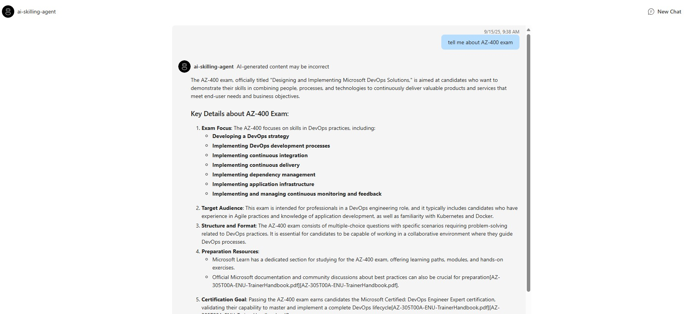

# AI Agents Using Azure AI Foundry for Learning and Certification Enablement  

Personalized AI mentor designed to streamline learning and certification for cloud and AI professionals. By curating tailored content, tracking progress, simulating exam scenarios, and recommending next steps based on individual roles and goals, it addresses the challenges of fragmented resources and unclear certification paths.

The agent leverages the Azure AI Agent service and utilizes file search for knowledge retrieval from uploaded files, enabling it to generate responses with citations. The solution also includes built-in monitoring capabilities with tracing to ensure easier troubleshooting and optimized performance.

## Solution Overview

This solution deploys a web-based chat application with an AI agent running in Azure Container App.

The agent leverages the Azure AI Agent service and utilizes Azure AI Search for knowledge retrieval from uploaded files, enabling it to generate responses with citations. The solution also includes built-in monitoring capabilities with tracing to ensure easier troubleshooting and optimized performance.

This solution creates an Azure AI Foundry project and Azure AI services. More details about the resources can be found in the [resources](#resources) documentation. There are options to enable logging, tracing, and monitoring.

Instructions are provided for deployment through GitHub Codespaces, VS Code Dev Containers, and your local development environment.

### Solution Architecture


The app code runs in Azure Container App to process the user input and generate a response to the user. It leverages Azure AI projects and Azure AI services, including the model and agent.

### Key Features

- **Knowledge Retrieval**<br/>
The AI agent uses file search to retrieve knowledge from uploaded files.

- **Customizable AI Model Deployment**<br/>
The solution allows users to configure and deploy AI models, such as gpt-4o-mini, with options to adjust model capacity, and knowledge retrieval methods.

- **Built-in Monitoring and Tracing**<br/>
Integrated monitoring capabilities, including Azure Monitor and Application Insights, enable tracing and logging for easier troubleshooting and performance optimization.

- **Flexible Deployment Options**<br/>
The solution supports deployment through GitHub Codespaces, VS Code Dev Containers, or local environments, providing flexibility for different development workflows.

- **Agent Evaluation**<br/>
This solution demonstrates how you can evaluate your agent's performance and quality during local development and incorporate it into monitoring and CI/CD workflow.


<br/>

Here is a screenshot showing the chatting web application with requests and responses between the system and the user:



## Getting Started

| [](https://codespaces.new/Azure-Samples/get-started-with-ai-agents) | [](https://vscode.dev/redirect?url=vscode://ms-vscode-remote.remote-containers/cloneInVolume?url=https://github.com/Azure-Samples/get-started-with-ai-agents) |
|---|---|

1. Click `Open in GitHub Codespaces` or `Dev Containers` button above
2. Wait for the environment to load
3. Run the following commands in the terminal:
   ```bash
   azd up
   ```
4. Follow the prompts to select your Azure subscription and region
5. Wait for deployment to complete (5-20 minutes) - you'll get a web app URL when finished

For detailed deployment options and troubleshooting, see the [full deployment guide](./docs/deployment.md).
**After deployment, try these [sample questions](./docs/sample_questions.md) to test your agent.**

## Local Development

For developers who want to run the application locally or customize the agent:

- **[Local Development Guide](./docs/local_development.md)** - Set up a local development environment, customize the frontend (starting with AgentPreview.tsx), modify agent instructions and tools, and use evaluation to improve your code.

This guide covers:
- Environment setup and prerequisites
- Running the development server locally
- Frontend customization and backend communication
- Agent instructions and tools modification
- File management and agent recreation
- Using agent evaluation for code improvement

## Other Features
Once you have the agents and the web app working, you are encouraged to try one of the following:

- **[Tracing and Monitoring](./docs/other_features.md#tracing-and-monitoring)** - View console logs in Azure portal and App Insights tracing in Azure AI Foundry for debugging and performance monitoring.

- **[Agent Evaluation](./docs/other_features.md#agent-evaluation)** - Evaluate your agent's performance and quality using built-in evaluators for local development, continuous monitoring, and CI/CD integration.

## Resource Clean-up

To prevent incurring unnecessary charges, it's important to clean up your Azure resources after completing your work with the application.

- **When to Clean Up:**
  - After you have finished testing or demonstrating the application.
  - If the application is no longer needed or you have transitioned to a different project or environment.
  - When you have completed development and are ready to decommission the application.

- **Deleting Resources:**
  To delete all associated resources and shut down the application, execute the following command:
  
    ```bash
    azd down
    ```

    Please note that this process may take up to 20 minutes to complete.

⚠️ Alternatively, you can delete the resource group directly from the Azure Portal to clean up resources.

### Resources

This template creates everything you need to get started with Azure AI Foundry:

| Resource | Description |
|----------|-------------|
| [Azure AI Project](https://learn.microsoft.com/azure/ai-studio/how-to/create-projects) | Provides a collaborative workspace for AI development with access to models, data, and compute resources |
| [Azure OpenAI Service](https://learn.microsoft.com/azure/ai-services/openai/) | Powers the AI agents for conversational AI and intelligent search capabilities. Default models deployed are gpt-4o-mini, but any Azure AI models can be specified per the [documentation](docs/deploy_customization.md#customizing-model-deployments) |
| [Azure Container Apps](https://learn.microsoft.com/azure/container-apps/) | Hosts and scales the web application with serverless containers |
| [Azure Container Registry](https://learn.microsoft.com/azure/container-registry/) | Stores and manages container images for secure deployment |
| [Storage Account](https://learn.microsoft.com/azure/storage/blobs/) | Provides blob storage for application data and file uploads |
| [AI Search Service](https://learn.microsoft.com/azure/search/) | *Optional* - Enables hybrid search capabilities combining semantic and vector search |
| [Application Insights](https://learn.microsoft.com/azure/azure-monitor/app/app-insights-overview) | *Optional* - Provides application performance monitoring, logging, and telemetry for debugging and optimization |
| [Log Analytics Workspace](https://learn.microsoft.com/azure/azure-monitor/logs/log-analytics-workspace-overview) | *Optional* - Collects and analyzes telemetry data for monitoring and troubleshooting |
