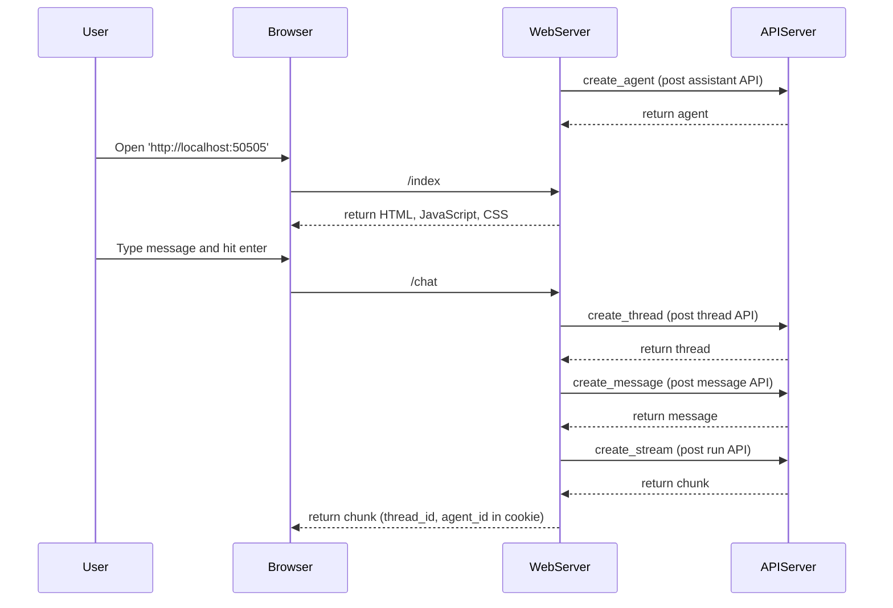

# Sample Application using Agents from Azure AI Projects and File Search tool (Python)

This sample includes a simple Python [Quart](https://quart.palletsprojects.com/en/latest/) app that streams responses from OpenAI Assistant to an HTML/JS frontend using Server-Sent Events (SSEs). The application is configured to upload two documents under the `files` folder for use with the OpenAI Assistant's File Search tool.

The sample is designed for use with [Docker containers](https://www.docker.com/), both for local development and Azure deployment. For Azure deployment to [Azure Container Apps](https://learn.microsoft.com/azure/container-apps/overview), please use this [template](https://github.com/Azure-Samples/openai-chat-app-quickstart) and replace the `src` folder content with this application.

## Application Flow

This application utilizes agents from the azure-ai-projects SDK to interact with the Azure ML agents API. The following sequence diagram describes the interaction between each component in the system. More comprehensive logic related to thread management will be discussed in the next section:



## Application Users and Thread Management

As a web application, it is designed to serve multiple users on multiple browsers. This application uses cookies to ensure that the same thread is reused for conversations across multiple tabs in the same browser. If the browser is restarted, the old thread will continue to serve the user. However, if the application has a new agent after a server restart or a thread is deleted, a new thread will be created without requiring a browser refresh or signaling to the users.

To achieve this, when users submit a message to the web server, the web server will create an agent, thread, and stream back a reply. The response contains `agent_id` and `thread_id` in cookies. As a result, each subsequent message sent to the web server will also contain these IDs. As long as the same agent is being used in the system and the thread can be retrieved in cookie, the same thread will be used to serve the users.


## Local development with Docker

This sample includes a `docker-compose.yaml` for local development which creates a volume for the app code. That allows you to make changes to the code and see them instantly.

1. Install [Docker Desktop](https://www.docker.com/products/docker-desktop/). If you opened this inside Github Codespaces or a Dev Container in VS Code, installation is not needed. ⚠️ If you're on an Apple M1/M2, you won't be able to run `docker` commands inside a Dev Container; either use Codespaces or do not open the Dev Container.

2. Make sure that the `.env` file exists.

3. Store a keys and endpoint information (Azure) for the OpenAI resource in the `.env` file. The key should be stored in the `.env` file as `PROJECT_CONNECTION_STRING`. This is necessary because Docker containers don't have access to your user Azure credentials.

4. Start the services with this command:

    ```shell
    docker-compose up --build
    ```

5. Click 'http://localhost:50505' in the browser to run the application.

## Example run


## Deployment to Azure

As mentioned earlier, please integrate this app using [template](https://github.com/Azure-Samples/openai-chat-app-quickstart) and following the Azure Container App deployment steps there.